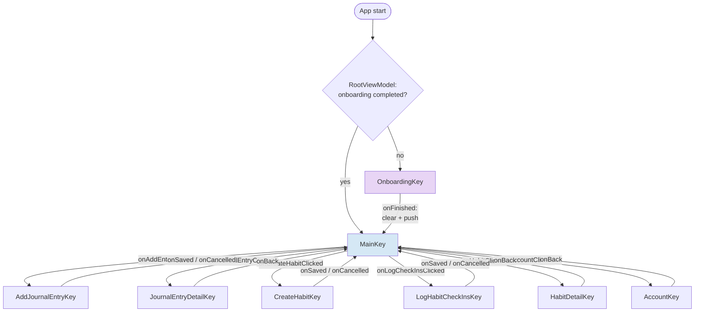
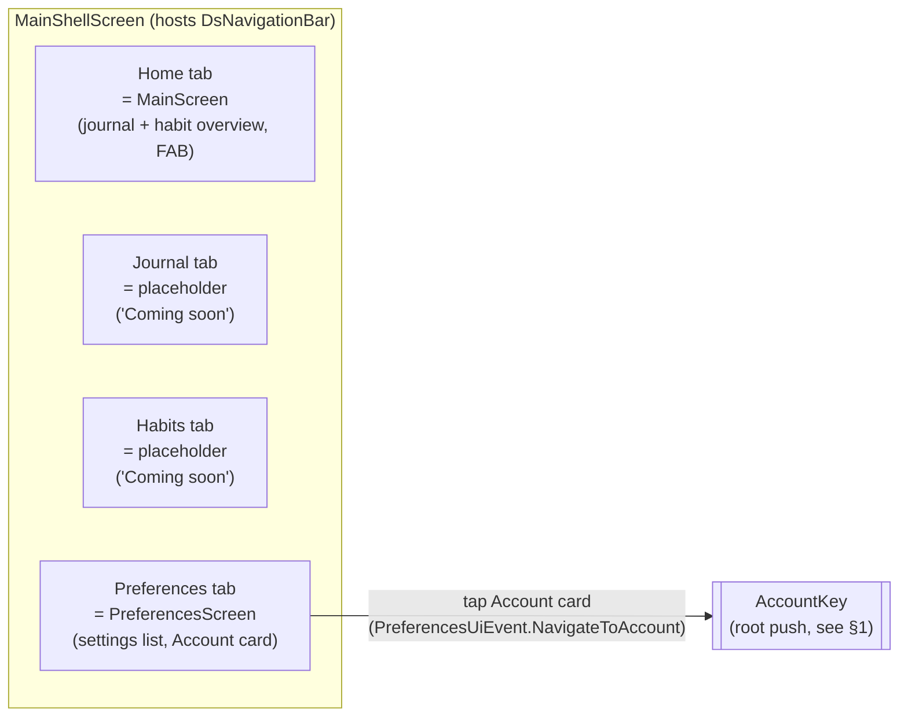
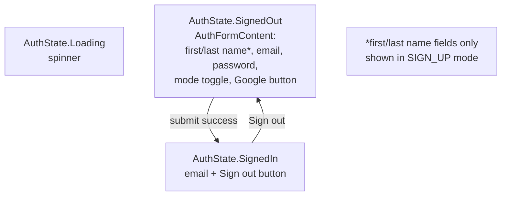
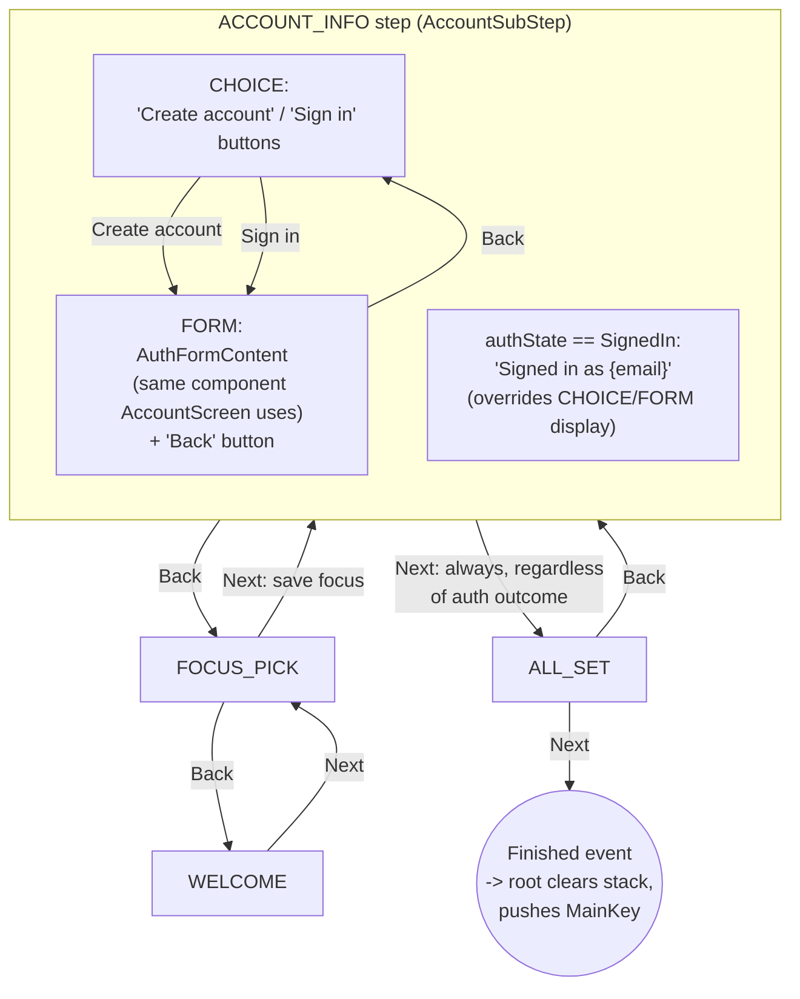

# Navigation Schema (as of supabase-auth-foundation, Phase 5)

Snapshot of the current navigation structure, for reviewing/adjusting flow and nesting before
continuing. Three distinct navigation layers exist today, each using a different mechanism:

1. **Root** — Navigation 3 (`NavDisplay` + a single `rememberNavBackStack`), in `TodayWasApp.kt`.
2. **Bottom-nav tabs** — plain local Compose state (`rememberSaveable { mutableStateOf(...) }`),
   in `MainShellScreen.kt`. Not part of the root back stack; no history, no deep-linking.
3. **Onboarding's internal steps** — a `HorizontalPager` driven by ViewModel state
   (`OnboardingStep` enum), in `OnboardingScreen.kt`. Also not part of the root back stack. The
   `ACCOUNT_INFO` step additionally has its own two-state `AccountSubStep` (`CHOICE` / `FORM`)
   layered inside it.

## 1. Root NavDisplay (`TodayWasApp.kt` / `TodayWasKey.kt`)

**Important nuance**: `MainKey`'s callbacks (`onAddEntryClicked`, `onJournalEntryClicked`,
`onCreateHabitClicked`, `onLogCheckInsClicked`, `onHabitClicked`, `onAccountClicked`) are all
threaded straight through `MainShellScreen` from whichever bottom-nav tab is currently showing —
today only the **Home** tab (wrapping `MainScreen`) and **Preferences** tab (wrapping
`PreferencesScreen`, for `onAccountClicked`) actually invoke any of them. So visually the user
might be on the "Journal" or "Habits" bottom-nav tab, but `AddJournalEntryKey` /
`CreateHabitKey` / etc. are still only reachable via the **Home** tab's FAB right now, not from
their own same-named tabs (those are still empty placeholders — see below). All six of these
destinations push onto the **root** back stack, so they render full-screen, covering the bottom
nav entirely (the bottom nav is chrome owned by `MainShellScreen`'s own `Scaffold`, one level
below the root `NavDisplay`).

## 2. Bottom-nav tabs (`MainShellScreen.kt`) — nested under `MainKey`, not in the root back stack

- Tab selection is local `rememberSaveable` state in `MainShellScreen` — switching tabs is
  instant, has no back-stack entry, and is **lost on process death** unless the `rememberSaveable`
  survives configuration/Bundle restore (it does across rotation, not across a killed process
  without saved-instance-state).
- `Home` is the only tab with real content; it's the pre-existing `MainScreen` unchanged.
- `Journal` and `Habits` are intentionally empty for now (explicitly deferred).
- `Preferences` is a settings-style screen. Its only interactive element right now is the
  **Account** card, which reads the current `AuthStateUi` (Loading / SignedOut / SignedIn) and,
  on tap, fires a one-shot `NavigateToAccount` event that the root `NavDisplay` turns into an
  `AccountKey` push.

## 3. `AccountScreen` (`AccountKey`, pushed from Preferences) — root-level, standalone

Hosts the actual sign-in/sign-up/sign-out UI via the shared `AuthFormContent` composable.

Errors during submit (either mode) surface as a `Snackbar` via a one-shot `ShowError` event —
not part of persistent state, so they don't reappear on rotation/recomposition.

## 4. Onboarding's internal step pager (`OnboardingScreen.kt` / `OnboardingStep.kt`)

A single `OnboardingKey` root entry internally drives a 4-step `HorizontalPager`, with
`ACCOUNT_INFO` further split into its own two-state sub-flow (`AccountSubStep`):

**Notes**:
- The wizard's own `Back` (system back gesture / `BackHandler`) only moves between
  `OnboardingStep`s (`WELCOME` ↔ `FOCUS_PICK` ↔ `ACCOUNT_INFO` ↔ `ALL_SET`). It does **not** know
  about `AccountSubStep` — going FORM → CHOICE only happens via the in-step "Back" text button,
  never via the system back gesture. (Currently: system back while in `FORM` jumps straight past
  `CHOICE` to `FOCUS_PICK`.)
- `Next` on `ACCOUNT_INFO` always advances to `ALL_SET`, regardless of `accountSubStep` or
  `authState` — signing in/up is optional, never a gate.
- `AuthFormContent` here is the **same shared composable** `AccountScreen` uses (Phase 4), so
  sign-up/sign-in/Google-sign-in and the name fields behave identically in both places. The
  underlying auth state (`AuthState`/`ObserveAuthStateUseCase`) is also shared — signing in during
  onboarding is immediately reflected in the Preferences tab's Account card afterward, and vice
  versa.
- Onboarding's `OnboardingViewModel` and `AccountScreen`'s `AccountViewModel` are **two separate
  ViewModels with duplicated form-handling logic** (deliberate — see plan.md's Critical
  Implementation Details on why a shared ViewModel wasn't used across unrelated screens). Only the
  stateless `AuthFormContent` UI and the use cases underneath are shared, not the ViewModel.

## Summary table

| Key / Step | Mechanism | Lives inside | Pushed/entered from | Exits via |
| --- | --- | --- | --- | --- |
| `OnboardingKey` | root NavDisplay | — | app start (if not completed) | `Finished` event → clear + `MainKey` |
| `MainKey` | root NavDisplay | — | app start (if completed) / onboarding finish | (never popped — root) |
| ↳ Home tab | local state in `MainShellScreen` | `MainKey` | default tab | switch tab |
| ↳ Journal tab | local state | `MainKey` | tap tab | switch tab (placeholder only) |
| ↳ Habits tab | local state | `MainKey` | tap tab | switch tab (placeholder only) |
| ↳ Preferences tab | local state | `MainKey` | tap tab | switch tab |
| `AccountKey` | root NavDisplay | — | Preferences tab's Account card | `onBack` → pop to `MainKey` |
| `AddJournalEntryKey` | root NavDisplay | — | Home tab's FAB | saved/cancelled → pop |
| `JournalEntryDetailKey` | root NavDisplay | — | Home tab's journal list | back → pop |
| `CreateHabitKey` | root NavDisplay | — | Home tab's FAB | saved/cancelled → pop |
| `LogHabitCheckInsKey` | root NavDisplay | — | Home tab's FAB | saved/cancelled → pop |
| `HabitDetailKey` | root NavDisplay | — | Home tab's habit list | back → pop |
| `WELCOME`/`FOCUS_PICK`/`ACCOUNT_INFO`/`ALL_SET` | `HorizontalPager` + ViewModel state | `OnboardingKey` | pager Next/Back | `Finished`/`ExitApp` events |
| ↳ `AccountSubStep.CHOICE`/`FORM` | ViewModel state | `ACCOUNT_INFO` step | Create account / Sign in / Back | (folded into `ACCOUNT_INFO`) |

## Open questions worth deciding before adjusting

- Should `AddJournalEntryKey`/`CreateHabitKey`/`LogHabitCheckInsKey`/`HabitDetailKey`/
  `JournalEntryDetailKey` eventually live "inside" the Journal/Habits tabs (once those get real
  content) rather than as root-level pushes reachable only from the Home tab's FAB? That's the
  most likely nesting change once Journal/Habits stop being placeholders.
- Should the bottom nav tabs gain their own nested back stacks (per the original
  `lessons.md` note "a future bottom nav bar gets its own nested Nav3 setup"), or is the current
  flat local-state switch (chosen for Phase 3, since only Home had real content) still the right
  call now that Preferences also pushes a real destination (`AccountKey`)?
- Should system back from `ACCOUNT_INFO`'s `FORM` sub-step go to `CHOICE` first instead of
  jumping straight to `FOCUS_PICK`?
- Is a root-level `AccountKey` (reachable only from Preferences) the right place for sign-in, or
  should Preferences' Account card open something scoped closer to "tab-local" navigation once
  bottom-nav tabs get their own nested graphs?
