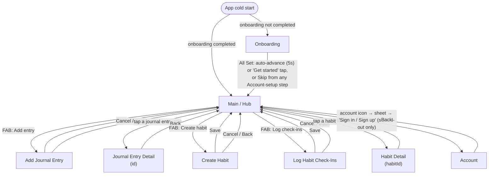
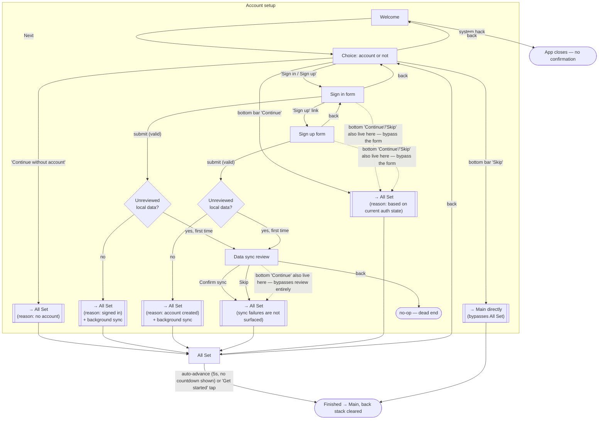
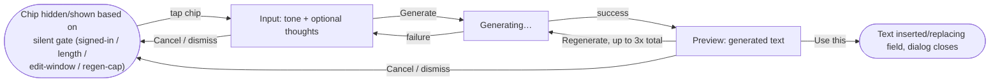

# TodayWas — Current Screen / Sheet / Dialog Graph

Snapshot of the app's actual navigation structure as of `51c3a8b` (`feature/ui-improvements`), built
by reading `TodayWasApp.kt` (the Navigation 3 back stack), `TodayWasKey.kt`, and each screen's
ViewModel/Composable for the sheets, dialogs, and internal step-flows they own. Edges are labeled
with the user action that causes them — this is a flow map, not just a structure inventory.

## 1. Top-level navigation (Navigation 3 back stack)

Every node below is a distinct `TodayWasKey` entry pushed/popped on the shared back stack in
`TodayWasApp.kt`. `Onboarding` and `Main` are the two possible initial destinations
(`RootViewModel` routes based on whether onboarding was already completed); every other screen is
only ever reached from `Main`.

**Notes on the edges above (flow-relevant, not just structural):**

- The FAB is a single control that either fires its one available action directly or expands into
  multiple `DsExtendedFloatingActionButton`s when more than one is available — "Add entry" and
  "Create habit"/"Log check-ins" are reached through the same FAB, not separate buttons.
- The `Account` screen is reachable **only** through the account-icon bottom sheet's "Sign in /
  Sign up" prompt, which only renders when signed **out** (see §2). There is currently no path from
  `Main` to the full `Account` screen while signed in — the signed-in state's only account-related
  UI is the bottom sheet itself (email + sign out), which never navigates to `AccountKey`.
- `Onboarding` is a single nav destination; everything inside it (Welcome, account choice, sign
  in/up, data-sync review, all-set) is internal step state on one ViewModel, not separate back-stack
  entries — see §3.

## 2. Bottom sheets and dialogs, per host screen

Every sheet/dialog below is presentational state on its host screen's `UiState` (a boolean or
nullable flag), not a navigation entry — closing one never pops the back stack.

### Main / Hub

| Element | Type | Opens via | Contains | Closes via |
|---|---|---|---|---|
| Account sheet | `DsModalBottomSheet` | Tap account icon (top bar) | **Signed in**: email + "Sign out" button. **Signed out**: description + "Sign in / Sign up" button | Scrim/back (`AccountSheetDismissed`), or "Sign in / Sign up" (navigates to `Account` screen and closes sheet) |
| Sign-out confirm | `DsAlertDialog` | "Sign out" button inside the account sheet | Confirm / Cancel | Confirm → signs out, closes both sheet and dialog. Cancel → closes dialog, sheet stays open |

### Add Journal Entry

| Element | Type | Opens via | Contains | Closes via |
|---|---|---|---|---|
| "Help me start" dialog | `DsAlertDialog` | "Help me start" chip (shown only when signed in) | 2-step: **Input** (tone picker + optional thoughts, "Generate") → **Preview** (generated text, "Regenerate" ×3 max, "Use this" / Cancel) | "Use this" → inserts text into the entry field, closes. Cancel/dismiss → discards the session (but the regeneration count already spent is preserved if reopened) |

### Journal Entry Detail

| Element | Type | Opens via | Contains | Closes via |
|---|---|---|---|---|
| Edit sheet | `DsBottomSheet` | Edit icon (top bar; hidden once past the 24h edit window) | Editable text field + "Help me refine" chip | Save / Cancel |
| "Help me refine" dialog | `DsAlertDialog` | "Help me refine" chip inside the edit sheet (gated: signed in + entry ≤ 8000 chars + still in edit window) | Same Input → Preview pattern as "Help me start" | "Use this" → replaces the edited text, closes. Cancel/dismiss → discards session |
| Delete entry confirm | `DsAlertDialog` | Delete icon (top bar; available regardless of edit window — deletion has no age limit by design) | Confirm / Cancel | Confirm → deletes, navigates back to `Main`. Cancel → closes |

### Create Habit

No dialogs or sheets — a single form screen; Save/Cancel navigate directly back to `Main`.

### Log Habit Check-Ins

No dialogs or sheets — a single list-of-rows screen with a date strip (today/yesterday); Save/Cancel
navigate directly back to `Main`.

### Habit Detail

| Element | Type | Opens via | Contains | Closes via |
|---|---|---|---|---|
| Edit sheet | `DsBottomSheet` | Tapping an eligible (in-window) check-in row | Editable rows for the loggable dates | Save / Cancel |
| Delete check-in confirm | `DsAlertDialog` | Delete action on a check-in row | Confirm / Cancel | Confirm → deletes that check-in. Cancel → closes |
| Delete habit confirm | `DsAlertDialog` | Top-level "Delete habit" action | Confirm / Cancel | Confirm → deletes the habit, navigates back to `Main`. Cancel → closes |

### Account

No dialogs or sheets of its own beyond what it shares with Onboarding (§3) — sign-in/sign-up forms
and, conditionally, the data-sync review content render inline on the screen itself, not in a sheet.

## 3. Onboarding — internal step flow (single nav destination)

Onboarding is one `TodayWasKey` entry; every transition below is internal `OnboardingStep` /
`AccountSubStep` state, not a back-stack push.

**Flow-relevant call-outs:**

- The bottom-bar "Continue"/"Skip" pair is visible and live on every `AccountSubStep`
  (`Choice`/`SignIn`/`SignUp`/`SyncReview`), including while a sign-in/sign-up form is actively
  being filled in or the sync-review summary is on screen — dotted edges above mark these
  always-available bypasses. This is the most tangled part of the graph: up to three different
  controls can be visible at once (form's own submit button, bottom "Continue", bottom "Skip"),
  each doing something different.
- `SyncReview`'s back action is a genuine dead end (no-op) — the only way out is Confirm or Skip
  (or the bottom-bar bypass).
- Sync failures inside `SyncReview` are never surfaced — both the Confirm path here and the
  equivalent flow in `Account` (§2/§4) proceed to All Set / stay signed in regardless of whether the
  background sync actually succeeded.

## 4. Shared mini-flow: AI-assist dialogs (Help me start / Help me refine)

Both dialogs (§2, Add Journal Entry and Journal Entry Detail) are independent implementations of
the same two-step flow:

Regeneration count persists across a dismiss-and-reopen within the same entry/session; there is no
way to go from `Preview` back to `Input` without a full dismiss (losing the generated text, though
not the regeneration count).

## Related

- `context/changes/ui-improvements/research.md` — per-screen UI findings (design-system
  consistency, missing states, flow friction, visual polish) layered on top of this structural map.
- `context/changes/ux-refinements/` — the prior change that established the current `Main` hub
  layout and the single generic account icon.
